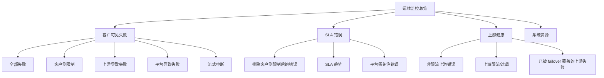

# 运维监控客户可见错误排障

> 状态：第一版兼容说明。原有“客户可见失败 / SLA 错误 / 客户侧限制 / 上游限流或过载”入口已由 2026-07-18 的 v2 结构化分类取代；HTTP 200 后的流式终态去重仍是后续阶段。

> 演进说明：本文保留第一版行为和兼容字段背景。当前代码已按 [运维失败分类与 SLA 重构](./ops-failure-classification-redesign.md) 和 [ADR 0004](../decisions/adr-0004-ops-failure-taxonomy-and-sla.md) 拆分客户可见性、失败归因和 SLA 影响；下文“当前口径”均指 v1 历史口径。

## 背景

管理员在运维监控里看到的两个卡片是：

- 请求错误
- 上游错误

它们现在主要服务于平台健康判断，而不是客户投诉排查。问题在于，客户反馈“站点报错”时，管理员第一反应会去看“请求错误”，但这个卡片默认展示的是 SLA 口径错误，不是所有客户可见失败。

这会造成一个很直接的错觉：

```text
客户：接口一直报错。
管理员：运维监控里错误率 0%，明细里也没几条。
实际：错误可能被归到了客户侧限制、429/529、流式中断、客户端断开或被当前筛选条件隐藏。
```

所以这不是单纯的文案问题，而是排障入口和指标口径混在一起了。

## 当前口径

### 请求错误

当前 SLA 卡片里的“SLA 错误”对应后端字段 `error_count_sla`，统计逻辑是：

```text
HTTP 状态码 >= 400
并且不是业务限制类错误
```

客户侧限制类错误会进入 `business_limited_count`，也就是卡片里的“客户侧限制”。

当前能归入业务限制的典型场景包括：

| 场景 | 客户体感 | 当前监控口径 |
| --- | --- | --- |
| 用户余额不足 | 报错 | 业务限制，不进 SLA 错误数 |
| API Key 额度用完 | 报错 | 业务限制，不进 SLA 错误数 |
| 日限额、周限额、月限额超过 | 报错 | 业务限制，不进 SLA 错误数 |
| RPM 或并发限制 | 报错 | 业务限制，不进 SLA 错误数 |
| API Key 无分组、分组停用、分组删除 | 报错 | 业务限制，不进 SLA 错误数 |
| IP 白名单限制 | 报错 | 业务限制，不进 SLA 错误数 |
| 模型不在白名单 | 报错 | 业务限制，不进 SLA 错误数 |
| 当前分组不允许某类接口 | 报错 | 业务限制，不进 SLA 错误数 |

这套口径对 SLA 是合理的，因为这些失败不代表平台服务不可用。但对客服排障不够友好，因为客户看见的确实是失败。第一版前端已经额外展示“客户可见失败”，用 `error_count_total / request_count_total` 表达客户实际收到失败响应的比例。

### 上游错误

当前卡片里的“非限流上游错误”对应 `upstream_error_count_excl_429_529`，统计逻辑是：

```text
错误归因为 provider
并且不是业务限制
并且上游状态码不是 429 / 529
```

`429/529` 被单独展示：

| 状态码 | 含义 | 当前监控处理 |
| --- | --- | --- |
| 429 | 上游限流、速率限制、请求过多 | 不进入“排除429/529”的上游错误数，单独计数 |
| 529 | 上游过载或类似过载状态 | 不进入“排除429/529”的上游错误数，单独计数 |

这个拆分有工程意义：429/529 通常是容量、限流、过载问题，和普通 5xx 故障不完全一样。但从客户角度看，它们仍然是失败。第一版已经把文案改成“非限流上游错误”和“上游限流/过载”，并且两个数字都可以进入对应明细。

## 为什么客户报错但看板不明显

### 1. 默认时间范围太短

运维监控默认时间范围是最近 1 小时。客户反馈如果发生在更早时间，卡片和明细都可能显示为 0。

排查时应先切到：

- 最近 6 小时
- 最近 24 小时
- 自定义时间范围

### 2. 默认明细视图只看 SLA 错误

错误明细弹窗当前有三个视图：

| 当前文案 | 实际含义 |
| --- | --- |
| SLA 错误 | 非客户侧限制的错误，也就是默认 SLA 口径 |
| 客户侧限制 | 余额、额度、分组、模型权限、IP、速率等客户侧限制 |
| 全部失败 | 所有客户可见失败 |

这里已经不再使用“排除项”作为展示文案。对管理员来说，客户侧限制不是“不用看的东西”，而是排查客户投诉时必须优先看的东西。

### 3. 业务限制不会进入 SLA 错误数

如果客户因为余额、额度、分组、白名单、模型权限、并发限制而失败，SLA 数字不会变差，但“客户可见失败”和“客户侧限制”会体现。

这解释了为什么管理员会觉得“客户一直说报错，但请求错误看起来没多少”。

### 4. 429/529 被单独拆出

如果上游主要是限流或过载，`非限流上游错误` 可能很低。管理员必须额外看 `上游限流/过载`。

当前文案已经拆开，但 429/529 是否需要进入告警阈值仍要根据真实线上噪音继续观察。

### 5. 流式请求存在 HTTP 200 后失败的盲区

很多 Claude Code、Codex、Chat Completions 场景都是流式请求。流式响应一旦开始，HTTP 状态可能已经是 200。后续如果出现：

- SSE 中途断开
- 上游流中返回错误事件
- 客户端主动取消
- 网络断开
- SDK 侧超时

这些错误不一定都能被普通 `status >= 400` 口径捕获。除非具体转发逻辑显式写入上游错误上下文，否则卡片上可能不明显。

### 6. 部分错误会被配置过滤

当前高级设置里有一些过滤项，例如：

- 默认忽略 `count_tokens` 错误
- 默认忽略 `context canceled` 客户端断开
- 错误透传规则如果设置 `skip_monitoring=true`，会跳过运维监控记录

这些过滤对降低噪音有帮助，但排查客户投诉时需要知道它们存在。

### 7. 最终请求成功时，中间上游失败不等于客户失败

系统可能先请求供应商 A 失败，再 failover 到供应商 B 成功。客户最终拿到 200，这不应算“客户可见失败”。

但它仍然说明上游不稳定，应进入上游健康观察。当前系统已有部分 recovered upstream error 记录，但展示入口还不够直观。

## 当前排查建议

管理员可以按下面顺序排查客户投诉。

### 第一步：向客户要最小证据

优先要这些信息：

- 报错时间，尽量精确到分钟。
- API Key 前缀。
- 用户邮箱或用户 ID。
- 模型名。
- 客户端类型，例如 Claude Code、Codex、Cherry Studio、Open WebUI。
- 错误截图或响应 JSON。
- 如果客户端能显示 request id，也一并提供。

没有时间和 Key 前缀时，排查成本会非常高。

### 第二步：扩大时间范围

运维监控先切到客户反馈时间所在窗口。不要只看默认最近 1 小时。

建议顺序：

```text
最近 6 小时 -> 最近 24 小时 -> 自定义时间段
```

### 第三步：看“全部失败”而不是默认“SLA 错误”

打开请求错误明细后，把范围从默认的“SLA 错误”切到“全部失败”。

如果要专门看客户侧余额、额度、分组、白名单、模型权限或速率问题，切到“客户侧限制”。

### 第四步：按 Key、用户、状态码和归因过滤

优先过滤：

- API Key 前缀
- 用户邮箱
- 模型
- 状态码
- 错误归因：client / provider / platform
- 阶段：auth / routing / upstream / internal

这样可以快速判断错误属于：

| 类型 | 处理方向 |
| --- | --- |
| 客户侧限制 | 看余额、额度、Key 状态、分组、IP、模型白名单 |
| 上游错误 | 看供应商、账号、上游状态码、是否 failover |
| 平台错误 | 看服务端日志、数据库、Redis、队列、部署版本 |
| 请求参数错误 | 看客户端请求格式、模型能力、接口类型 |

### 第五步：如果客户说“中途断了”，优先按流式问题查

如果客户不是收到标准 JSON 错误，而是出现：

- 生成到一半断了
- Claude Code 提示 stream error
- Codex 提示 connection closed
- 客户端显示 timeout

这类问题不要只盯着 `status >= 400`。需要同时看：

- 上游错误明细
- 系统日志
- 客户端超时配置
- Nginx / OpenResty 代理超时
- 是否出现 context canceled
- 是否是 HTTP 200 后的 SSE 错误

## 已落地的第一版

### 1. 增加“客户可见失败”一级指标

已新增一个排障优先的卡片：

```text
客户可见失败
失败数：N
客户侧限制：A
上游限流/过载：B
上游非限流：C
平台错误：D
```

这个卡片不负责表达 SLA，只负责回答一个问题：

```text
客户到底有没有看到失败？
```

当前统计口径：

```text
status_code >= 400
```

后续可补充“HTTP 200 后流式失败”作为独立计数，不要混进普通 HTTP 失败里。

### 2. 保留 SLA 错误，但改名

当前“SLA”卡片里保留 SLA 口径，并把错误数改成：

```text
SLA 错误
```

或：

```text
平台需关注错误
```

副信息中展示：

```text
已排除客户侧限制：N
```

这样管理员不会误以为它代表所有客户报错。

### 3. 重命名业务限制

当前“业务限制”已改成：

```text
客户侧限制
```

相比“业务限制”，这个词更贴近日常运维语境，也更容易让管理员联想到余额、额度、分组、IP、模型权限等客户侧问题。

### 4. 重命名上游错误口径

当前：

```text
错误数（排除429/529）
429/529
```

已改成：

```text
非限流上游错误
上游限流/过载
```

这样管理员不用先理解 429/529 才能判断问题。

### 5. 明细筛选改成排障语义

当前：

```text
错误 / 排除项 / 全部
```

已改成：

```text
SLA 错误 / 客户侧限制 / 全部失败
```

默认打开请求错误明细时，按入口区分：

- 从“客户可见失败”进入：默认全部失败
- 从“SLA 错误”进入：默认 SLA 错误
- 从“客户侧限制”进入：默认客户侧限制
- 从“上游限流/过载”进入：默认 429/529

### 6. 增加常用原因快捷筛选

建议在错误明细顶部提供快捷筛选：

- 余额不足
- Key 额度用完
- Key 无效
- 分组限制
- IP 限制
- 模型不允许
- 上游 429/529
- 上游 5xx
- 客户端断开
- 流式中断

这些比单纯状态码更适合客服排查。

### 7. 流式失败单独建口径

后续应补一个独立指标：

```text
流式中断 / HTTP 200 后失败
```

它不应简单混进 `status >= 400`，因为技术口径不同。但它必须能在客户投诉排障里被查到。

第一版可以先做：

- 记录 SSE 已开始后出现的上游错误。
- 记录客户端断开但上游仍在响应的场景。
- 记录网关主动终止流的原因。
- 明细里标记 `stream_started=true`、`terminal_event=error|disconnect|timeout`。

### 8. 排障入口保留 request id 链路

理想排障路径应该是：

```text
客户反馈 request id / key 前缀
-> 搜到客户可见失败
-> 查看错误归因
-> 查看上游尝试链
-> 查看最终是否 failover
-> 查看账号、供应商、模型、状态码、响应体
```

如果某次请求经历了多次上游尝试，明细页要能展示：

```text
供应商 A: 429
供应商 B: 500
供应商 C: 成功
```

这样管理员能区分“客户最终失败”和“中间上游失败但被救回”。

## 推荐的页面结构



## 第一版实施范围

第一版先做前端和查询口径调整，不大改日志结构。

### 已完成

- 新增“客户可见失败”卡片，展示 `error_count_total / request_count_total`。
- SLA 卡片继续保留 SLA 口径，错误数文案改成“SLA 错误”。
- “业务限制”改名为“客户侧限制”。
- “错误数（排除429/529）”改名为“非限流上游错误”。
- “429/529”改名为“上游限流/过载”。
- 明细弹窗视图改名：
  - `错误` -> `SLA 错误`
  - `排除项` -> `客户侧限制`
  - `全部` -> `全部失败`
- 从不同卡片进入明细时，自动带上对应筛选。
- 错误列表接口支持 `status_codes_exclude`，用于从“非限流上游错误”进入时排除 429/529。

### 后续可做

- 增加余额不足、Key 额度用完、分组限制、上游 429/529 等快捷筛选。
- 在明细表增加更直观的“客户是否可见失败”字段。
- 在错误详情里显示“是否计入 SLA”。

### 暂不做

- 暂不改变 SLA 计算公式。
- 暂不把客户侧限制计入平台 SLA。
- 暂不强行把所有流式中断并入 HTTP 错误率。
- 暂不改用户侧扣费和用量记录。

## 验收标准

第一版完成后，管理员应该能完成下面的排障任务：

1. 客户只提供时间和 Key 前缀，也能在“客户可见失败”里找到相关失败。
2. 客户因余额或额度失败时，不需要知道“排除项”这个概念，也能看到原因。
3. 上游 429/529 不再藏在“排除429/529”旁边，而是作为“上游限流/过载”直观展示。
4. SLA 错误和客户可见失败不再混淆。
5. 错误详情能说明该错误是否计入 SLA，以及为什么不计入。

## 需要注意的边界

- 客户侧限制不应该计入平台 SLA，否则会让平台稳定性指标失真。
- 客户侧限制必须能被排查，否则客服无法回应客户投诉。
- 429/529 不应该被完全视为普通 5xx，但必须在客户失败排查里可见。
- 流式中断需要独立口径，不能简单用普通 HTTP 状态码推断。
- 任何“忽略错误”的设置都应该在排障入口有提示，否则管理员会误以为系统没记录。
