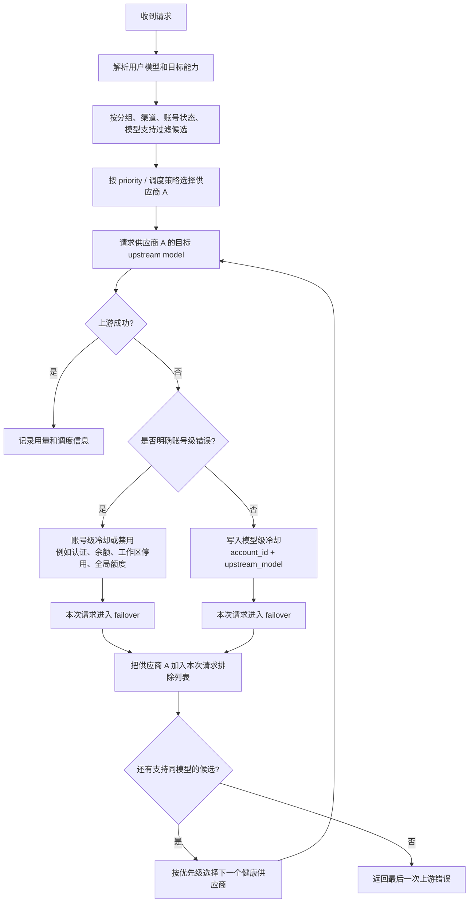

# 上游供应商成本感知与模型级调度

> 状态：分阶段落地中。模型级错误转移第一版已覆盖 OpenAI / Claude / Gemini；供应商默认配置、真实快照综合折扣和 `strict_priority` / `cost_first` 已落地，余额查询与更高级的 balanced / canary 策略仍是后续设计。

## 这份设计解决什么

- 这份文档既记录已经落地的模型级错误转移，也记录后续成本感知调度设计。
- 讨论范围包括：上游账号调度解释、模型级健康、供应商成本配置、综合折扣计算、上游余额查询。
- 会影响到的页面主要是：
  - 管理员账号管理：`/admin/accounts`
  - 管理员使用记录：`/admin/usage`
  - 可用渠道和模型价格：`/available-channels`
  - 管理员渠道价格：`/admin/channels/pricing`
- 第一版不做这些事：
  - 不改变用户侧扣费口径。
  - 不向普通用户暴露上游账号、供应商成本、利润或调度链路。
  - 不把上游余额查询放进请求转发热路径。
  - 不要求第一版自动修改已有账号优先级。

这份设计要解决的是多上游供应商带来的运营问题：同一类模型在不同供应商上的真实成本、稳定性和余额状态都不同，只靠账号级 priority 很难表达“优先用便宜的，但不要把稳定性搞坏”。

## 问题定义

管理员可能会接入多个上游供应商。每家供应商都可能提供 `haiku`、`sonnet`、`opus` 这类模型系列，但价格、倍率、充值折扣和稳定性并不一样。

现有账号级调度主要有几类问题：

1. **成本和稳定性冲突**
   - 最便宜的供应商通常会被设置成最高优先级。
   - 如果这个供应商不稳定，严格优先级会放大失败和故障转移。
   - 如果为了稳定性降低它的优先级，又会失去低成本优势。

2. **账号级冷却粒度过粗**
   - 一个供应商的 `haiku` 暂时不可用，不代表它的 `sonnet` 和 `opus` 也不可用。
   - 如果直接冷却整个账号，系统会跳过这个供应商仍然便宜、仍然可用的其它模型。
   - 最终成本会因为一个模型异常而整体抬高。

3. **优先级选择缺少解释**
   - 管理员看到优先级 1 的账号看似正常，但使用记录里却出现了其它供应商。
   - 实际原因可能是粘性会话、模型限制、并发负载、冷却、失败重试排除或渠道限制。
   - 没有调度解释时，管理员无法判断这是合理调度还是策略缺陷。

4. **真实供应商成本不可见**
   - 上游分组倍率、充值比例和市场汇率共同决定真实成本。
   - 只看模型官方价或站内倍率，无法判断某个供应商对当前模型是否真的便宜。

5. **上游余额需要独立观测**
   - 多个供应商余额分散，管理员需要及时发现余额不足。
   - 上游通常是 `sub2api`、`new-api`、`aether` 等开源网关或其二开版本，余额接口可能存在但格式不统一。

## 当前代码现状

现有代码已经有一部分基础，但还谈不上完整的成本感知调度：

- `Account.IsSchedulable()` 是账号级可调度判断，会受 `RateLimitResetAt`、`TempUnschedulableUntil`、`OverloadUntil`、账号状态、配额等影响。
- `IsSchedulableForModelWithContext()` 已经会读取 `model_rate_limits`，支持模型级或能力级冷却。
- OpenAI 图片限流、上游模型不存在、OpenAI / Claude / Gemini 非明确账号级的上游模型错误已经写入模型级冷却。
- 账号认证失败、余额不足、工作区停用、明确全局额度或账单问题仍按账号级处理。
- OpenAI 选择器也不是简单粗暴地“只选 priority=1”：
  - 先尝试粘性会话。
  - 再按可调度、模型支持、渠道限制、能力支持过滤。
  - 普通路径按优先级和 LRU 选择。
  - 负载感知路径在同优先级内还会比较并发负载。
  - 失败重试会通过 excluded account 跳过刚失败的账号。

所以第一阶段不应该先假设优先级算法错了，而是先补齐调度解释。只有知道每次为什么选这个账号、为什么跳过另一个账号，后面才好判断到底是策略问题还是正常故障转移。

## 目标

### 1. 按模型保留低成本供应商

如果供应商 A 的 `haiku` 不可用，但 `sonnet` 和 `opus` 可用，调度只应该跳过：

```text
供应商 A + haiku
```

而不是把整个供应商 A 都跳过：

```text
供应商 A 的所有模型
```

这样 `haiku` 请求可以临时切到供应商 B；`sonnet` 和 `opus` 仍然继续用供应商 A。

### 2. 把真实成本从“人工感觉”变成可计算字段

管理员配置成本时，在资金池维护充值比例和参考市场汇率，在账号成本绑定维护消费倍率：

- 资金池：上游充值比例、参考市场汇率、基础成本。
- 账号绑定：默认消费倍率（吸收原上游分组倍率）。
- 账号绑定：可选的模型族倍率覆盖。

系统负责算出综合折扣，用于展示、排序建议，以及后续成本感知调度。

### 3. 给每次非预期调度一个解释

管理员看到某条请求用了供应商 B 时，应该能看到供应商 A 为什么没被选上：

```text
A skipped: model_rate_limited, model=claude-3-5-haiku, reset_at=2026-06-21T12:30:00+08:00
B selected: lowest effective cost among healthy candidates
```

### 4. 让上游余额成为运营信号

系统应支持定时或手动刷新供应商余额，并展示最后成功时间、余额、单位、失败原因和低余额状态。

第一版余额只做观测和提醒；后续再考虑把余额作为调度降权或跳过条件。

## 调度原则

推荐的调度顺序是：

```text
候选账号过滤 -> 模型级健康判断 -> 成本排序 -> 稳定性和负载微调 -> 可解释记录
```

每一步的含义：

1. **过滤**：先排除账号状态不可用、模型不支持、渠道限制不匹配、能力不匹配的账号。
2. **模型级健康**：优先检查 `account_id + model_key`、模型族、能力范围的冷却状态。
3. **成本排序**：在健康候选里优先选择综合折扣更低的账号。
4. **稳定性微调**：结合近期失败率、延迟、并发负载和粘性会话，决定是否要偏离最低成本。
5. **可解释记录**：记录被排除原因、得分项和最终选择原因。

## 健康状态设计

### 分层冷却

| 层级 | 示例 | 调度影响 |
| --- | --- | --- |
| 账号级 | token 无效、账号被封、余额不足、全局配额耗尽、上游主机不可达 | 整个账号跳过 |
| 模型级 | `claude-3-5-haiku` 不存在、单模型 429 | 只跳过该账号的该模型 |
| 模型族级 | `haiku` 系列不可用 | 只跳过该账号的该模型族 |
| 能力级 | 图片生成限流、embedding 限流 | 只跳过对应能力请求 |

### 错误怎么分

| 错误类型 | 处理建议 |
| --- | --- |
| 401 token revoked / invalidated | 账号级错误或账号级临时不可调度 |
| 403 account disabled / KYC / policy block | 账号级错误或策略级阻断 |
| 402 / credit balance exhausted | 账号级不可调度，附余额原因 |
| 429 with model-specific signal | 模型级或模型族级冷却 |
| 429 with global quota header | 账号级冷却 |
| 404 / model_not_found | 模型级冷却 |
| 非明确账号级的上游 4xx / 5xx / 529 | 当前账号 + 当前 upstream model 短冷却，并触发本次请求转移 |
| 上游网络错误 / 代理不可达 | 账号级临时不可调度，短冷却 |
| 本地能识别的参数错误 / 客户端请求错误 | 不进入上游调度，不冷却账号 |

第一版上线策略会故意偏向可用性：只要请求已经明确落到某个上游模型，且错误内容不是认证、余额、工作区停用、全局额度、账单这类账号级问题，就先认为是“这个供应商的这个模型暂时不可用”。这样能最大限度保住同一个低成本供应商的其它模型。

### 冷却键

可以沿用并扩展当前 `model_rate_limits` 结构：

```json
{
  "model_rate_limits": {
    "claude-3-5-haiku": {
      "rate_limit_reset_at": "2026-06-21T12:30:00+08:00",
      "reason": "model_upstream_error"
    },
    "family:haiku": {
      "rate_limit_reset_at": "2026-06-21T12:30:00+08:00",
      "reason": "upstream_family_unavailable"
    },
    "capability:image_generation": {
      "rate_limit_reset_at": "2026-06-21T12:30:00+08:00",
      "reason": "upstream_image_rate_limit"
    }
  }
}
```

第一版先只做“具体 upstream model key”更稳，避免模型族推断误伤；模型族和能力级可以后续再增强。

### 自动转移流程



这个流程的关键点是：`供应商 A + haiku` 失败后，只冷却这个模型组合；同一个供应商 A 的 `sonnet`、`opus` 不会因为这次 `haiku` 错误被整体跳过。

## 成本配置设计

> 长期可靠的充值账本、共享余额池、账号成本绑定和历史成本快照模型见 [上游供应商资金池与成本账本](./upstream-cost-pools-and-ledger.md)。本节只描述调度侧如何消费“账号最终有效成本”，不再把真实充值账本建模为账号私有数据。

### 字段边界

真实充值账本、参考汇率和基础成本不再建模为账号私有字段，而是归属资金池，见 [资金池数据结构](./upstream-cost-pools-and-ledger.md#推荐数据结构)。调度侧只消费两类输入：

| 输入 | 来源 | 说明 |
| --- | --- | --- |
| 资金池基础成本 | 资金池当前成本快照 `effective_cny_per_usd` | 该资金池当前每 1 USD 额度的真实人民币成本 |
| 账号消费倍率 | 账号成本绑定 `upstream_group_multiplier`（兼容存储列 `default_multiplier`）/ `model_family_multipliers` | 该账号对应的上游 key 在此资金池上按什么倍率折算成本 |
| 分组计价基准 | 账号成本绑定 `price_reference_currency` | 上游分组倍率相对人民币价目表还是美元价目表计算；取值为 `CNY` / `USD` |
| 计价基准确认 | 账号成本绑定 `price_reference_confirmed` | 只有管理员明确确认后的绑定才可进入成本排序和 `cost_first` |

两点边界：

- 不要复用现有账号的 `rate_multiplier` 表达上游成本。那个字段已经有对用户扣费和统计的含义，混入上游成本会让历史成本解释不清。
- 上游分组倍率和计价基准都属于账号成本绑定，因为同一供应商 / 资金池可以同时包含人民币定价分组和美元定价分组；不能按供应商所在地或模型名称自动猜测。

如果同一个资金池下不同模型族倍率不同，用账号绑定的模型族覆盖值表达：

```text
账号默认倍率：1.0
haiku 覆盖：0.35
sonnet 覆盖：0.50
opus 覆盖：0.80
```

### 计算公式

综合折扣按真实人民币成本算。基础成本来自资金池当前快照，倍率来自账号成本绑定：

```text
计价基准系数 = 1（price_reference_currency = CNY）
             或 reference_fx_rate（price_reference_currency = USD）
基础成本系数 = pool_effective_cny_per_usd / 计价基准系数
综合折扣 = 基础成本系数 × account_multiplier
折扣展示 = 综合折扣 × 10 折
```

计算进入账号列表排序和调度快照还需同时满足：资金池存在真实 `current_snapshot_id`，且绑定 `price_reference_confirmed=true`。迁移前的历史绑定暂按旧美元公式保存，但标记为未确认、在页面显示“待确认”，并在确认前排除出 `cost_first`。

人民币官方价分组示例：

```text
资金池基础成本 = 1 CNY/USD（1 RMB 获得 1 USD 额度）
分组计价基准 = CNY
账号倍率 = 0.80
综合折扣 = 1 / 1 × 0.80 = 0.80
展示等于 8 折
```

美元官方价分组示例：

```text
资金池基础成本 = 1 CNY/USD（1 RMB 获得 1 USD 额度）
参考汇率 = 7
基础成本系数 = 1 / 7 = 0.143
账号倍率 = 0.50
综合折扣 = 0.143 × 0.50 = 0.0715
展示约等于 0.7 折
```

如果资金池基础成本更高，例如 2 CNY/USD（花 2 RMB 获得 1 USD 额度）：

```text
基础成本系数 = 2 / 7 = 0.286
账号倍率 = 0.50
综合折扣 = 0.286 × 0.50 = 0.143
展示约等于 1.4 折
```

### 展示建议

账号管理页可以这样展示：

| 供应商 | 模型族 | 计价基准 | 资金池充值 | 账号倍率 | 综合折扣 | 建议优先级 |
| --- | --- | --- | --- | --- | --- | --- |
| A | kimi | CNY | 1 RMB = 1 USD | 0.80 | 8.0 折 | 1 |
| A | haiku | USD | 1 RMB = 1 USD | 0.35 | 0.5 折 | 1 |
| B | haiku | USD | 1 RMB = 1 USD | 0.50 | 0.7 折 | 2 |
| C | sonnet | USD | 2 RMB = 1 USD | 0.30 | 0.9 折 | 2 |

第一版只展示和给排序建议，不自动改写账号 priority。自动策略要等调度解释、模型级健康都稳定后再开。

## 成本感知选择器

### 策略模式

建议保留现有 priority 语义，再新增可选策略：

| 策略 | 行为 | 适用场景 |
| --- | --- | --- |
| `strict_priority` | 仍以账号 priority 为主，只增加模型级健康过滤 | 保守默认 |
| `cost_first` | 健康候选中优先选择综合折扣最低 | 成本优先 |
| `balanced` | 在成本、失败率、延迟、负载之间加权 | 长期目标 |
| `canary` | 给备份供应商少量探测流量 | 避免备份长期不可知 |

第一版推荐：

```text
strict_priority + model-scoped cooldown + scheduling explanation
```

这样风险最低，也能先查清“优先级 1 明明没问题，为什么用了别人”的真实原因。

### 候选评分草案

长期可以引入评分：

```text
score =
  cost_weight × normalized_effective_discount
  + priority_weight × normalized_priority
  + failure_weight × recent_failure_rate
  + latency_weight × recent_latency
  + load_weight × current_load
  - stickiness_bonus
```

分数越低，优先级越高。

这里要守住几条底线：

- `priority` 不应消失，它是管理员的人工兜底权重。
- `cost` 不应压过硬健康状态，不健康账号不能因为便宜而被选。
- `canary` 流量必须有上限，例如 1% 或每 N 分钟一次。
- 策略切换必须可回滚。

## 调度解释

### 解释内容

每次选账号时，建议记录一份轻量解释：

```json
{
  "requested_model": "claude-3-5-haiku",
  "selected_account_id": 12,
  "selected_reason": "lowest_cost_healthy_candidate",
  "strategy": "strict_priority",
  "candidates": [
    {
      "account_id": 10,
      "priority": 1,
      "status": "skipped",
      "reason": "model_rate_limited",
      "scope": "claude-3-5-haiku",
      "reset_at": "2026-06-21T12:30:00+08:00"
    },
    {
      "account_id": 12,
      "priority": 2,
      "status": "selected",
      "effective_discount": 0.0725
    }
  ]
}
```

### 展示位置

管理员可以在这些地方看到解释：

- 使用记录行详情：说明“为什么选了这个上游账号”。
- 账号管理页：展示当前模型级冷却状态。
- 调度诊断页或弹窗：按请求 ID 查看候选账号过滤过程。

解释记录只对管理员开放，不进入用户侧接口。

## 上游余额查询

### 原则

余额查询应作为后台观测能力，不应该影响请求转发延迟。

规则：

- 不在网关请求热路径实时查询余额。
- 使用后台定时任务或手动刷新。
- 对每个账号保存最近一次余额快照。
- 余额查询失败不应立即禁用账号。
- 多次连续失败后只显示告警，不自动假定余额为 0。

### 适配器配置

不同上游实现的接口不一致，建议做成供应商适配器：

| 字段 | 说明 |
| --- | --- |
| `balance_provider_type` | `sub2api`、`new-api`、`aether`、`custom` |
| `balance_base_url` | 上游站点地址 |
| `balance_auth_type` | Bearer、API Key header、cookie 或 custom |
| `balance_endpoint` | 查询路径 |
| `balance_json_path` | 余额字段位置 |
| `balance_unit` | USD、credit、RMB 或 unknown |
| `balance_refresh_interval_minutes` | 刷新间隔 |
| `balance_low_threshold` | 低余额阈值 |

第一版先支持：

1. 手动配置 `custom` JSON path。
2. 内置 `sub2api` / `new-api` / `aether` 的默认路径和解析器。
3. 手动刷新按钮。
4. 最近刷新结果展示。

### 安全边界

余额查询会接触上游 token 和外部 URL，必须收紧安全边界：

- token 只后端保存和使用，前端不回显明文。
- 请求设置短超时。
- 禁止跟随无限重定向。
- 限制响应体大小。
- 记录失败原因时脱敏 URL query、Authorization、cookie。
- 如果允许访问内网地址，必须由管理员显式开启；默认要防 SSRF。

### 调度联动

余额和调度的联动建议分阶段推进：

| 阶段 | 行为 |
| --- | --- |
| 第一阶段 | 只展示余额和低余额告警 |
| 第二阶段 | 余额低于阈值时降低调度权重 |
| 第三阶段 | 明确余额为 0 且连续确认后跳过账号 |

第一版不要因为余额查询失败就直接禁用账号。

## 推进顺序

### 阶段 1：调度解释

要做的事：

- 记录账号候选过滤原因。
- 解释为什么优先级更高的账号没有被选。
- 在管理员使用记录或诊断入口展示解释。

验收点：

- 对一次请求能看到 selected account。
- 至少能区分以下 skipped reason：
  - `sticky_account_unusable`
  - `account_unschedulable`
  - `model_unsupported`
  - `model_rate_limited`
  - `runtime_blocked`
  - `channel_restricted`
  - `concurrency_full`
  - `excluded_after_failure`

### 阶段 2：模型级冷却扩展

当前状态：第一版已落地到 OpenAI / Claude / Gemini。非明确账号级错误会写入 `account_id + upstream_model` 的短冷却，并触发本次请求 failover；认证、余额、账单、工作区停用、明确全局额度等仍走账号级处理。

要做的事：

- 将非明确账号级的模型请求错误写入 `model_rate_limits`。（已覆盖 OpenAI / Claude / Gemini）
- 保留账号级错误对整账号的影响。
- 避免 `haiku` 异常误伤 `sonnet` / `opus`。

验收点：

- 供应商 A 的 `haiku` 报错后，本次请求会转移到下一个支持 `haiku` 的供应商。
- 供应商 A 的 `haiku` 报错后，A 的 `sonnet` 仍可被选。
- 模型不存在只影响对应 mapped upstream model。
- 账号认证失败仍整账号不可调度。

### 阶段 3：供应商成本配置和综合折扣

前置：资金池、账号成本绑定和成本快照模型已按 [上游供应商资金池与成本账本](./upstream-cost-pools-and-ledger.md) 落地。本阶段只负责把「账号最终有效成本」接入调度侧展示和排序建议，不再在账号上直接录入真实充值。

要做的事：

- 管理员在资金池维护充值账本、参考汇率和基础成本；在账号成本绑定维护消费倍率和模型族覆盖。
- 系统按资金池当前快照和账号倍率计算综合折扣。
- 账号列表支持按模型族查看成本排序建议。

验收点：

- 资金池基础成本 `1 CNY/USD`、参考汇率 `7`、账号倍率 `0.50` 显示约 `0.7 折`。
- 不同模型族可覆盖账号默认倍率。
- 不改变现有扣费和用量统计口径。

### 阶段 4：成本感知调度策略

要做的事：

- 在模型级健康过滤后，按综合折扣选择低成本供应商。
- 保留 strict priority 模式作为默认和回滚路径。
- 支持小流量 canary 探测备份供应商健康。

验收点：

- `strict_priority` 行为和现有优先级兼容。
- `cost_first` 能在同模型健康候选中选择最低综合折扣账号。
- 解释记录展示得分和选择原因。

#### 阶段 4 落地细化（`cost_first` 首版）

> 本节细化「按最便宜供应商调度」的首版落地口径，只覆盖 `strict_priority` 与 `cost_first` 两种策略；`balanced` / `canary` 仍属后续。

**设置项（全局）**

`SystemSettings` 新增：

```go
// settings_view.go
ScheduleStrategy string `json:"schedule_strategy"` // "strict_priority" | "cost_first"
```

- 默认 `"strict_priority"`（＝现状）。非法值一律回退 `"strict_priority"`（安全默认）。
- 同步 `config` 加载、admin 设置读写、前端设置页二选一开关。
- 满足「策略切换必须可回滚」：不开 `cost_first` 时行为与现有优先级逐字节兼容。

**综合折扣进入调度快照**

调度是热路径，不能每请求查库：

- 在账号快照 / 调度缓存（`backend/internal/repository/scheduler_cache.go`）为每账号预解析并携带 `effectiveDiscount *float64`（`nil` = 未绑定成本池 / 无有效资金池快照）。
- 从 active 账号成本绑定读取资金池真实快照、`default_multiplier`、`price_reference_currency` 和 `price_reference_confirmed`，按本文公式计算综合折扣，在快照构建 / 刷新时算一次。
- 只有存在 `current_snapshot_id` 的真实成本才进入综合折扣；供应商默认充值配置不会被当成调度成本。
- `price_reference_confirmed=false` 的历史绑定不生成调度成本。字段省略的旧客户端更新同一资金池时保留已有基准和确认状态；切换到新资金池仍省略时创建未确认绑定。
- 首版 `cost_first` 使用账号绑定的标量 `default_multiplier`。`model_family_multipliers` 仍保留为后续请求模型族感知成本的领域字段，但当前比较器不会按每次请求动态选择模型族倍率；在该能力落地前，不应把模型族覆盖描述成已经参与自动成本调度。
- 充值新增、修改或删除提交后，主动刷新该资金池所有 active 绑定账号的调度快照；数据库仍是最终事实来源。

**排序语义（`cost_first`，折扣为主、priority 兜底）**

在**现有可用性 / 模型级健康 / 负载过滤之后**，对候选集排序：

1. 综合折扣升序（越低＝成本越便宜越优先）；`effectiveDiscount == nil` 视为「最大」，**统一垫底**。
2. 折扣相同 → 按 `account.priority` 升序（现有人工兜底权重，不消失）。
3. 再相同 → 现有 load/lastUsed 打散（`gateway_scheduling.go:shuffleWithinPriorityAndLastUsed` 逻辑不变）。

实现建议：在 `gateway_scheduling.go` 按 `ScheduleStrategy` 选择比较器；`filterByMinPriority` 在 `cost_first` 下对应改为「取最低折扣组」（与现有取最小 priority 组对称），未配成本账号不进入「最低折扣组」除非无其它候选。

**未配成本账号 / 全未配的退化**

- `effectiveDiscount == nil` 的账号排在所有已配账号之后，组内按 `priority` + 现有打散。
- 若**所有**候选都未配成本池：整体退化为现状 `strict_priority` 逻辑（保证确定性，且对未启用成本池功能的用户零影响）。

**边界与验收补充**

- 成本池解析失败 / 数据缺失 → 该账号 `nil` 垫底，不阻断调度。
- `cost` 不压过硬健康：不健康账号不因便宜被选（健康过滤在排序前）。
- 回归保护：`strict_priority` 分支与现状逐字节一致——实现以「新增分支、不改老分支」为原则。

**测试计划（首版）**

- 单元：`cost_first` 比较器（低折扣优先；`nil` 垫底；折扣相同回退 priority；全 `nil` 退化 `strict_priority`）。
- 单元：`strict_priority` 与现状行为一致（回归保护）。
- 集成：多账号 + 不同资金池折扣，验证选中顺序；成本数据更新后快照刷新生效。
- 设置：非法 `schedule_strategy` 回退默认；读写往返。
- 前端：开关切换触发保存；文案。

### 阶段 5：上游余额查询

要做的事：

- 支持供应商余额手动/定时刷新。
- 展示余额、单位、刷新时间和失败原因。
- 支持低余额告警。

验收点：

- 余额查询不阻塞普通请求。
- token 不在前端明文展示。
- 查询失败不会直接禁用账号。
- 连续低余额可在账号管理页明显提示。

## 权限和数据边界

这些字段属于管理员运营信息：

- 上游账号名称。
- 上游站点地址。
- 上游余额。
- 上游 token。
- 综合折扣。
- 供应商真实成本。
- 调度候选和排除原因。
- 上游模型映射链。

用户侧接口不得返回这些字段。用户侧仍然只看自己可见的模型、用量、实际扣费和已授权分组信息。

管理员导出可以包含成本和调度解释，但必须避免导出上游 token 明文。

## 风险

### 只看成本会伤稳定性

如果最低成本供应商本身不稳定，直接开启 `cost_first` 会放大失败率。需要先有模型级健康和失败率统计，再开启自动成本调度。

### 模型级错误可能误判

上游错误格式不统一。某些错误虽然发生在模型请求上，实际可能是账号级额度耗尽、认证失败或供应商整体异常。

为了尽快上线验证，第一版不再只盯 429 或明确模型信号，而是采用“账号级明确证据优先”的判断：认证、余额、工作区停用、全局额度、账单问题仍按账号级处理；其它带目标模型的上游错误先按模型级短冷却处理。这个策略更符合当前上游返回不规范的现实，但需要通过调度记录观察误判率。

### 余额接口不统一

`sub2api`、`new-api`、`aether` 和二开版本可能接口不同。第一版应允许 custom JSON path，避免硬编码单一协议。

### 调度解释会带来存储成本

完整候选列表可能比较大。可以先只保存最近请求、失败请求，或者只在管理员开启诊断时保存。

## 推荐优先级

建议按下面的顺序推进：

1. 调度解释。
2. 模型级冷却扩展。
3. 供应商成本配置和综合折扣展示。
4. 成本感知调度策略。
5. 上游余额查询和低余额告警。

这个顺序的原因很直接：先解释当前行为，才能判断优先级异常到底是不是真的；先缩小冷却粒度，才能避免低成本供应商被单模型故障整体淘汰；最后再让成本自动参与调度，风险最低。
