# dev-sd Plan

## Multi-Upstream Account and Key Scheduling

Date: 2026-05-06

Status: implementation in progress

Current implementation status:

- Implemented for Anthropic API-key passthrough accounts, which is the immediate
  relay-provider scenario that motivated this plan.
- This is only the first implemented platform. The target secondary-development
  model applies to every platform that can be configured as an API-key account,
  including Anthropic, OpenAI, Gemini, and Antigravity where that platform's API
  key forwarding path exists.
- Account-level scheduling still uses the existing load-aware selector.
- Account-internal child-key scheduling now uses priority plus least-recently-used
  ordering.
- Each child key now owns its model whitelist/mapping. A child key that cannot
  serve the requested model is skipped before any upstream request is sent.
- Key/model cooldown is stored against the resolved upstream model, not the
  site-facing model alias.
- Existing OpenAI/Gemini/Antigravity/Bedrock forwarding paths are not yet all
  converted to this child-key pool. Do not assume this PLAN is complete for a
  platform until that platform's forwarding service explicitly consumes
  `account_api_keys` and has tests covering key-level scheduling.

### Background

The `dev-sd` branch is being adapted for a second-layer relay operation model.
The deployment is not primarily a pool of official Claude/OpenAI accounts.
Instead, the site fronts multiple upstream relay providers. Each upstream
provider may expose different model sets, different API keys, different error
behavior, and different temporary availability for the same model.

This requirement is platform-wide for API-key account types. Anthropic is the
first concrete implementation because the production failure case was Claude
relay traffic, but the intended end state is that every API-key platform uses
the same upstream key-pool concept instead of a single top-level `API Key` field.

The current runtime can already select accounts, apply account model mappings,
track account-level concurrency/load, and fail over between accounts when a
forwarding path returns `UpstreamFailoverError`. It also has an account/model
cooldown mechanism through `extra.model_rate_limits`.

The missing target capability is a full two-level scheduler:

1. Account-level scheduling across upstream providers.
2. Key-level scheduling inside each upstream provider account.

### Target Flow

For a user request targeting a model such as `haiku4.5`:

1. The gateway receives the request and resolves the group/platform/model route.
2. The account scheduler chooses an upstream account using model support,
   priority, current load, concurrency, cooldown state, and existing exclusions.
3. Inside the selected upstream account, the key scheduler filters child keys by
   child-key model whitelist/mapping, key priority, key load, key status, and
   key/model cooldown state.
4. The request is sent to the upstream with the selected key and that key's
   final upstream model. If the key inherits model rules, this is the account's
   resolved upstream model; if the key has its own mapping, the key mapping may
   override the account-level upstream model.
5. If the request succeeds, the response is returned normally.
6. If the selected key fails for the selected model, only that key/model pair is
   cooled down and the request tries the next key.
7. If all keys in the account are unavailable for that model, the request tries
   the next account.
8. If all accounts and keys are exhausted, the user receives a unified,
   site-level friendly error response.

### Target Flow Diagram

The diagram below captures the desired two-level scheduling behavior. Account
and key counts are examples only; implementation must support arbitrary account
and key counts.

```mermaid
graph LR
    A[User request<br/>target model] --> B[Gateway request entry]

    B --> C[Load-aware account scheduler<br/>priority + concurrency/load/usage]
    C -->|priority tier 1 + balanced| Acc1[Upstream account 1]
    C -->|priority tier 2 + balanced| Acc2[Upstream account 2]
    C -->|priority tier 3 + balanced| Acc3[Upstream account 3]

    Acc1 -->|key priority 1| Key1_1[API key 1-1]
    Acc1 -->|key priority 2| Key1_2[API key 1-2]
    Acc1 -->|key priority 3| Key1_3[API key 1-3]

    Key1_1 --> CC1{Current key + upstream model<br/>cooling down?}
    CC1 -- cooling down, skip --> Key1_2
    CC1 -- available --> R1[Send upstream model request]
    R1 --> S1{Request result}
    S1 -- success --> OK[Return normal response]
    S1 -- upstream key/model failure --> CD1[Cool down only<br/>current key + upstream model]
    CD1 --> Key1_2

    Key1_2 --> CC2{Key + upstream model<br/>cooling down?}
    CC2 -- cooling down, skip --> Key1_3
    CC2 -- available --> R2[Send upstream request]
    R2 --> S2{Request result}
    S2 -- success --> OK
    S2 -- upstream key/model failure --> CD2[Mark key + upstream model cooldown]
    CD2 --> Key1_3

    Key1_3 --> CC3{Key + upstream model<br/>cooling down?}
    CC3 -- cooling down, skip --> Acc2
    CC3 -- available --> R3[Send upstream request]
    R3 --> S3{Request result}
    S3 -- success --> OK
    S3 -- account keys exhausted --> Acc2

    Acc2 -->|key priority 1| Key2_1[API key 2-1]
    Acc2 -->|key priority 2| Key2_2[API key 2-2]

    Key2_1 --> CC4{Key + upstream model<br/>cooling down?}
    CC4 -- cooling down, skip --> Key2_2
    CC4 -- available --> R4[Send upstream request]
    R4 --> S4{Request result}
    S4 -- success --> OK
    S4 -- upstream key/model failure --> CD3[Mark key + upstream model cooldown]
    CD3 --> Key2_2

    Key2_2 --> CC5{Key + upstream model<br/>cooling down?}
    CC5 -- cooling down, skip --> Acc3
    CC5 -- available --> R5[Send upstream request]
    R5 --> S5{Request result}
    S5 -- success --> OK
    S5 -- account keys exhausted --> Acc3

    Acc3 -->|key priority loop| Key3_1[API key 3-1]
    Key3_1 --> CC6{Key + upstream model<br/>cooling down?}
    CC6 -- cooling down, skip --> Fail[No available account/key/model resource]
    CC6 -- available --> R6[Send upstream request]
    R6 --> S6{Request result}
    S6 -- success --> OK
    S6 -- final upstream error --> ERR[Classify final upstream error]

    ERR --> E400[400 -> friendly request-parameter error]
    ERR --> E401[401 -> friendly authorization unavailable error]
    ERR --> E429[429 -> friendly rate-limit/capacity error]
    ERR --> EOther[Other -> friendly upstream busy error]

    E400 & E401 & E429 & EOther --> ErrOut[Unified user-facing error]
    Fail --> ErrOut
```



### Core Requirement

Cooldown and failure isolation must be model scoped and key scoped.

Correct:

```text
packycode / key-1 / claude-haiku-4.5 is cooled down
packycode / key-2 / claude-haiku-4.5 remains usable
packycode / key-1 / claude-opus-4.7 remains usable
```

Incorrect:

```text
packycode account is made temporarily unschedulable for all models
```

Account-level temporary unschedulable state is too broad for this use case. It
would incorrectly block Opus/Sonnet traffic when only Haiku is failing on one
upstream key.

### Model Mapping Rule

Cooldown should be recorded against the final upstream model ID used by the
selected key, not blindly against the inbound user-facing model.

Example:

```text
Inbound model: haiku4.5
Account mapping: haiku4.5 -> claude-3-5-haiku-20241022
Cooldown key: selected_api_key + claude-3-5-haiku-20241022
```

The left side of account model mapping is the site-facing/request model. The
right side is the actual upstream model ID. Failure isolation should use the
right side because that is what the upstream provider accepted or rejected.

### Load Balancing Requirement

Scheduling should combine priority and load balancing instead of sending all
traffic to one upstream until it fails.

Expected policy:

1. Respect priority tiers first.
2. Within the same priority tier, distribute by current load/concurrency,
   recent usage, and last-used time.
3. Avoid selecting accounts or keys currently cooled down for the requested
   upstream model.
4. Exclude failed accounts/keys for the current request immediately, even before
   persistent cooldown state is written.
5. Keep routing deterministic enough for operators to reason about, but avoid
   request pileups on a single node.

### Error Classification

Not every upstream `400` should fail over.

Fail over and cool down the selected key/model when the upstream error indicates
that the selected provider/key/model is unusable for this request, such as:

- model not found
- model not supported by the key
- model access denied for the key
- relay-specific business restriction, for example "please use the official
  client" or `cch_session_id`
- upstream rate limit or quota exhaustion for this key/model
- upstream transient errors such as `429`, `529`, and `5xx`

Do not blindly fail over when the user request itself is invalid, such as:

- malformed JSON
- invalid Anthropic/OpenAI message schema
- unsupported request parameter
- invalid `max_tokens`
- missing required request field

Final user-facing errors should be site-level and friendly. Raw upstream relay
messages should not be returned directly to normal API users after the full
failover chain is exhausted.

Suggested final error categories:

```text
400 -> request parameter error
401 -> upstream authorization unavailable
429 -> upstream capacity/rate limit busy
5xx/other -> upstream service temporarily unavailable
all exhausted -> no available upstream resource for this model
```

Operator logs and ops traces should retain enough sanitized detail to diagnose
which account/key/model failed.

### Data Model Direction

The current API-key account stores a single `credentials.api_key`. That is not
enough for true account-internal key scheduling.

Preferred durable model:

```text
account_api_keys
  id
  account_id
  name
  api_key_encrypted
  priority
  status
  model_restriction_mode
  model_mapping
  global_cooldown_until
  last_used_at
  current_concurrency
  recent_request_count
  recent_error_count
  created_at
  updated_at
```

Key/model cooldown can be stored as either a child table or structured JSON.
For operator visibility and future statistics, a table is preferable:

```text
account_api_key_model_cooldowns
  id
  account_api_key_id
  upstream_model
  reason
  status_code
  cooldown_until
  last_error_at
  last_error_message_sanitized
```

Avoid burying all key state inside one large account credentials JSON blob if
the feature is expected to support UI management, statistics, and debugging.

### Scheduler Shape

The final scheduler should be explicitly two-level:

```text
SelectAccountForModel(...)
  -> account candidates filtered by group/platform/model/cooldown/status
  -> ordered by priority plus load-aware tie breaking

SelectAccountKeyForModel(account, upstreamModel, requestState)
  -> key candidates filtered by child-key model rules/status/key-model cooldown/global cooldown
  -> ordered by key priority plus load-aware tie breaking

ForwardWithSelectedKey(...)
  -> sends request with selected key and selected key's final upstream model
  -> classifies upstream errors
  -> updates key/model cooldown when appropriate
  -> returns a failover signal without writing partial response bytes
```

Streaming caveat:

If response bytes have already been written to the client, failover must stop.
The current handler already guards against stream corruption by refusing to
switch accounts after bytes are written. The key-level implementation must keep
that invariant.

### UI Requirements

Admin account management should eventually support:

- adding multiple keys under one upstream account for every API-key platform
- using the upstream API key pool as the only key input surface for API-key
  account modes; the older top-level single `API Key` input should be removed
  platform by platform as each runtime forwarding path is converted
- editing key note/name, priority, and enabled/disabled status
- key status should be an operator-controlled two-state switch: enabled or
  disabled. Runtime/provider failures should not create a manually selectable
  "error" key state; they should be shown through key/model cooldowns, error
  counters, and sanitized last-error details.
- requiring a note/name for every newly added child key so operators can record
  the upstream provider group or purpose of that key
- configuring per-key model rule mode:
  - whitelist models that this key can use
  - map site/request models or account-resolved upstream models to this key's
    actual upstream model IDs
- hiding account-level model restriction UI for API-key accounts whose runtime
  path uses the upstream key pool, because those accounts must express model
  capability at the child-key level instead of sharing one account-level model
  rule set
- viewing key health and cooldown state
- clearing a key/model cooldown manually
- seeing which key handled a request in ops logs or request details

The priority field is a scheduling order weight, not a quota. It should match
the account priority semantics: lower values are tried first, and newly created
keys default to priority `1`. Keys in the same priority tier are rotated by
recent usage/last-used state.

The key-level model mode should be phrased for operators, not as an internal
implementation detail. For API-key relay accounts, every key represents an
upstream credential that may have a different provider group and model set, so
there should be no "inherit account model limits" mode in the key-pool UI. Each
key must explicitly define a whitelist or mapping, and an empty per-key model
configuration should be treated as incomplete rather than "supports all".

The current model restriction and model mapping UI remains important:

- account mapping left side = site-facing model
- account mapping right side = upstream model
- fetched supported models should help fill right-side upstream model IDs
- channel pricing/mapping remains the site-facing model catalog exposed to users

### Migration Strategy

Existing one-key API-key accounts should keep working.

Suggested migration behavior:

1. If an account has no child keys but has `credentials.api_key`, treat it as a
   legacy single-key account.
2. On first edit or explicit migration, create one child key from the existing
   `credentials.api_key`.
3. Do not remove legacy credential support until runtime, UI, backups, and docs
   all support child keys.
4. Keep rollback simple: existing single-key accounts must remain readable.

### Implementation Phases

Phase 1: Design and regression tests

- Add tests that describe desired account/key/model failover behavior.
- Cover Anthropic API-key passthrough first because that is the current failing
  production path.
- Cover `400` business restriction failover separately from genuine user
  parameter errors.
- Cover stream-started behavior to ensure no partial stream failover occurs.

Phase 2: Backend key model

- Add key storage and repository methods.
- Add encryption/decryption path for child API keys using the existing secret
  handling pattern.
- Add key status, priority, last-used, and cooldown reads/writes.
- Add per-key model whitelist/mapping storage so different child keys under the
  same account can expose different model sets.
- Preserve legacy `credentials.api_key` behavior.

Phase 3: Scheduler integration

- Extend account selection to remain account-level.
- Add key selection inside selected account before forwarding.
- Track current-request failed keys separately from failed accounts.
- Write key/model cooldowns on classified upstream failures.
- Continue to the next key before moving to the next account.

Phase 4: Error classification and friendly final errors

- Centralize upstream error classification.
- Add relay-specific classifiers for known business restriction messages.
- Ensure raw relay messages are logged in sanitized operator traces but not
  returned directly to users after failover exhaustion.

Phase 5: Admin UI

- Add account-internal key management.
- Show key priority, status, cooldowns, and recent health.
- Add manual cooldown clear where safe.
- Surface selected key information in admin ops/request detail views.

Phase 6: Documentation and deployment notes

- Update `secondary-dev/README.md`, `secondary-dev/PATCHES.md`, and
  `secondary-dev/CHANGELOG.md` when implementation lands.
- Document migration behavior and backup expectations.
- Document recommended production modeling for relay providers and keys.

### Verification Checklist

Backend tests should prove:

- key/model cooldown skips only the failed key/model pair
- child-key model whitelist/mapping skips keys that cannot serve the requested
  model before an upstream request is sent
- child-key model mapping can override the account-level resolved upstream
  model for that selected key
- other models on the same key remain schedulable
- other keys for the same upstream account remain schedulable
- account-level failover happens only after all suitable keys are exhausted
- load-aware selection distributes traffic within equal priority tiers
- `400` request-parameter errors do not incorrectly fail over
- relay business-restriction `400` errors do fail over
- `401`, `429`, `529`, and `5xx` policies are explicit and tested
- streaming failover does not happen after bytes are written
- legacy single-key accounts continue to work

Frontend tests should prove:

- administrators can add/edit/remove multiple keys under one account
- key priority and status persist correctly
- cooldown state is displayed without confusing it with account-level disabled
  state
- existing model restriction and mapping save/load behavior is unchanged

Operational checks should prove:

- request logs identify account, key, requested model, upstream model, and
  failover reason
- final user errors are friendly and do not leak raw upstream relay messages
- deployment backup flow still captures required config/data before upgrade

### Open Design Questions

- Should `401` disable or globally cool down the key, rather than only cooling
  one key/model pair?
- Should cooldown duration be fixed, configurable globally, configurable per
  account, or classified by error type?
- Should load balancing prefer least-current-concurrency, least-recent-usage,
  weighted random, or the existing account scheduler's load metric?
- Should same-priority accounts be strictly balanced, or should priority remain
  dominant enough that lower-priority accounts only receive traffic after
  higher-priority capacity is constrained?
- How much raw upstream error detail should be visible in admin-only ops views?

### Non-Goals For This Plan

- Do not solve this by making entire accounts temporarily unschedulable for
  model-specific failures.
- Do not treat all `400` responses as retryable or failover-safe.
- Do not remove existing account-level scheduler behavior without preserving
  current single-key deployments.
- Do not auto-commit implementation work without explicit user approval.
